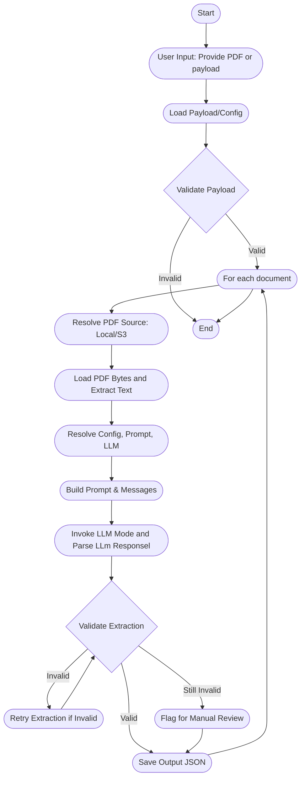

```mermaid
flowchart TD
    Start([Start])
    UserInput([User Input: Provide PDF or payload])
    LoadPayload([Load Payload/Config])
    ValidatePayload{Validate Payload}
    BatchLoop([For each document])
    ResolveSource([Resolve PDF Source: Local/S3])
    LoadPDF([Load PDF Bytes and Extract Text])
    ResolveConfig([Resolve Config, Prompt, LLM])
    BuildPrompt([Build Prompt & Messages])
    ModelQuery([Invoke LLM Mode and Parse LLm Responsel])
    ValidateExtract{Validate Extraction}
    RetryExtract([Retry Extraction if Invalid])
    FlagManual([Flag for Manual Review])
    SaveOutput([Save Output JSON])
    End([End])

    Start --> UserInput
    UserInput --> LoadPayload
    LoadPayload --> ValidatePayload
    ValidatePayload -->|Valid| BatchLoop
    ValidatePayload -->|Invalid| End
    BatchLoop --> ResolveSource
    ResolveSource --> LoadPDF
    LoadPDF --> ResolveConfig
    ResolveConfig --> BuildPrompt
    BuildPrompt --> ModelQuery
    ModelQuery --> ValidateExtract
    ValidateExtract -->|Valid| SaveOutput
    ValidateExtract -->|Invalid| RetryExtract
    RetryExtract --> ValidateExtract
    ValidateExtract -->|Still Invalid| FlagManual
    FlagManual --> SaveOutput
    SaveOutput --> BatchLoop
    BatchLoop --> End
```
