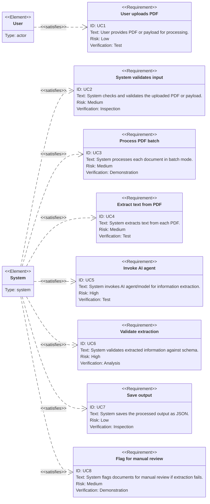

```mermaid
requirementDiagram

direction LR

requirement "User uploads PDF" {
    id: UC1
    text: "User provides PDF or payload for processing."
    risk: Low
    verifymethod: Test
}

requirement "System validates input" {
    id: UC2
    text: "System checks and validates the uploaded PDF or payload."
    risk: Medium
    verifymethod: Inspection
}

requirement "Process PDF batch" {
    id: UC3
    text: "System processes each document in batch mode."
    risk: Medium
    verifymethod: Demonstration
}

requirement "Extract text from PDF" {
    id: UC4
    text: "System extracts text from each PDF."
    risk: Medium
    verifymethod: Test
}

requirement "Invoke AI agent" {
    id: UC5
    text: "System invokes AI agent/model for information extraction."
    risk: High
    verifymethod: Test
}

requirement "Validate extraction" {
    id: UC6
    text: "System validates extracted information against schema."
    risk: High
    verifymethod: Analysis
}

requirement "Save output" {
    id: UC7
    text: "System saves the processed output as JSON."
    risk: Low
    verifymethod: Inspection
}

requirement "Flag for manual review" {
    id: UC8
    text: "System flags documents for manual review if extraction fails."
    risk: Medium
    verifymethod: Demonstration
}

element "User" {
    type: actor
}

element "System" {
    type: system
}

"User" - satisfies -> "User uploads PDF"
"System" - satisfies -> "System validates input"
"System" - satisfies -> "Process PDF batch"
"System" - satisfies -> "Extract text from PDF"
"System" - satisfies -> "Invoke AI agent"
"System" - satisfies -> "Validate extraction"
"System" - satisfies -> "Save output"
"System" - satisfies -> "Flag for manual review"

```
